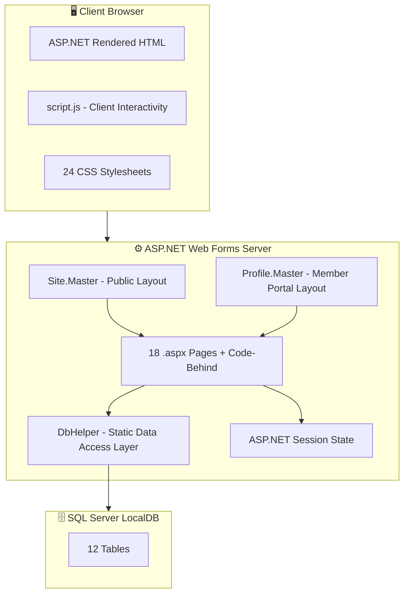
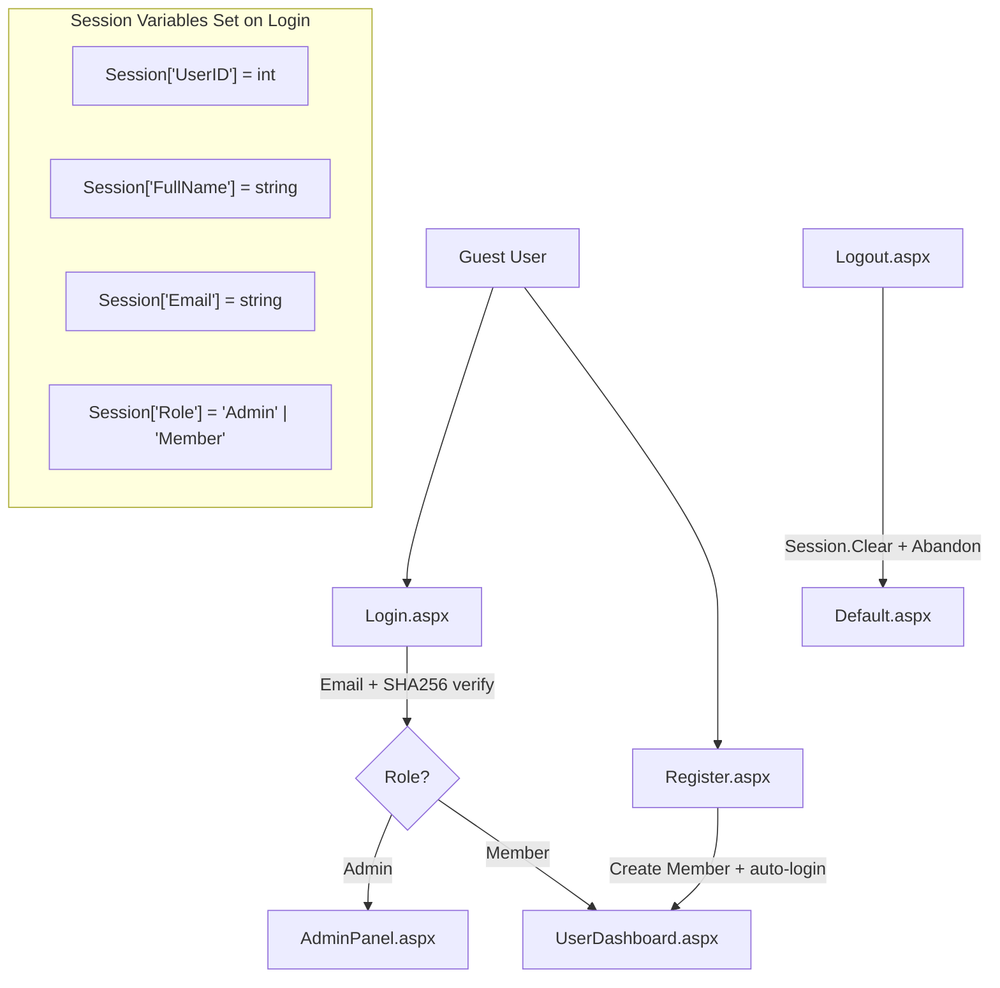
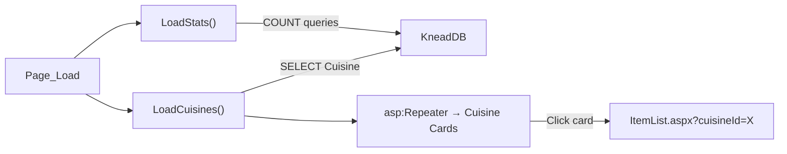
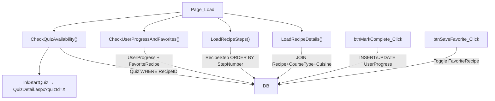
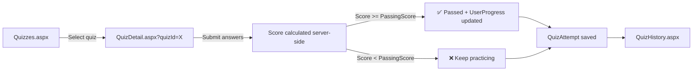
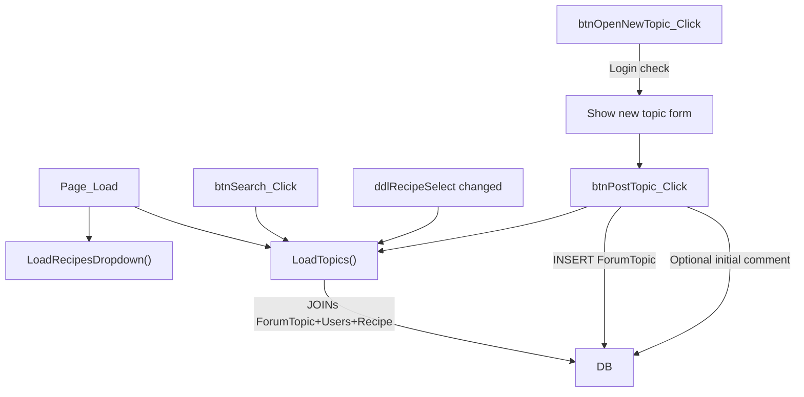
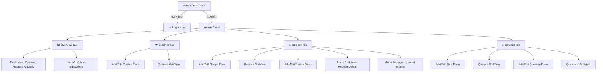
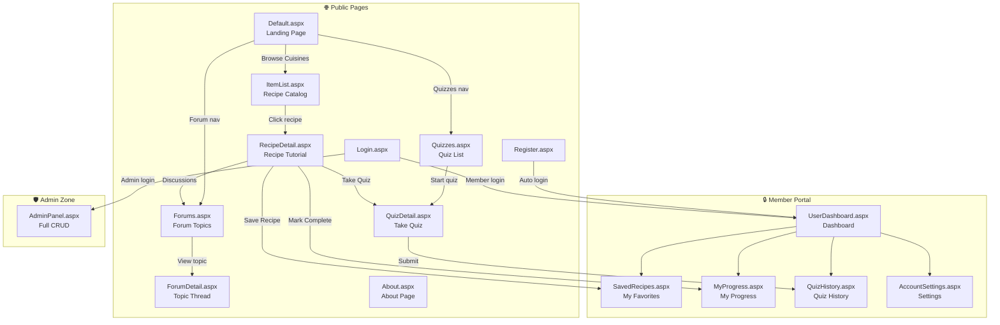
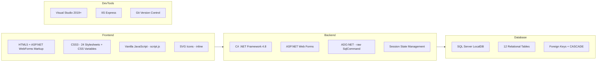

# 🍞 Knead — Culinary Learning Management System (LMS)

## Full MVP Documentation

---

## 1. Project Overview

**Knead** is a **Culinary Learning Management System** built with **ASP.NET Web Forms (.NET Framework 4.8)** and **SQL Server (LocalDB)**. It enables users to learn cooking through structured recipe tutorials organized by cuisine, take quizzes to test their knowledge, track progress, save favourite recipes, and participate in community forums.

| Property | Value |
|---|---|
| **Framework** | ASP.NET Web Forms (.NET 4.8) |
| **Language** | C# (code-behind) |
| **Database** | SQL Server LocalDB (`KneadDB`) |
| **Web Server** | IIS Express (port 5000) |
| **Namespace** | `KneadLMS` |
| **Solution File** | [Knead.sln](file:///D:/Coding/.NET%20WAPP/Knead_Assignment/Knead.sln) |
| **Project File** | [Knead.csproj](file:///D:/Coding/.NET%20WAPP/Knead_Assignment/Knead.csproj) |

---

## 2. Architecture Overview



### Key Architectural Decisions

1. **No ORM** — All database access uses raw ADO.NET via the static [`DbHelper`](file:///D:/Coding/.NET%20WAPP/Knead_Assignment/About.aspx.cs#L14-L175) class
2. **No separate DAL project** — `DbHelper` is compiled inline in [About.aspx.cs](file:///D:/Coding/.NET%20WAPP/Knead_Assignment/About.aspx.cs) (not in `App_Code`, which is empty)
3. **Session-based auth** — No ASP.NET Identity/Membership; simple `Session["UserID"]`, `Session["Role"]` checks
4. **SHA-256 password hashing** — Via `DbHelper.HashPassword()` and `DbHelper.VerifyPassword()`
5. **Two Master Pages** — `Site.Master` (public navbar + footer) and `Profile.Master` (minimal header, back button)

---

## 3. Directory Structure

```
Knead_Assignment/
├── 📄 Knead.sln                    # Visual Studio solution
├── 📄 Knead.csproj                 # Project file (.NET 4.8 Web App)
├── 📄 Web.config                   # Connection string + runtime config
├── 📄 schema.sql                   # Full DB schema creation script
├── 📄 seed_data_patch.sql          # Extended seed data (30KB)
├── 📄 .env                         # Empty environment file
│
├── 🎨 Site.Master / .cs            # Public page master layout
├── 🎨 Profile.Master / .cs         # Member portal master layout
│
├── 📄 Default.aspx / .cs           # Landing page (hero + stats + cuisines)
├── 📄 Home.aspx / .cs              # Redirects to Default.aspx
├── 📄 Login.aspx / .cs             # Login form
├── 📄 Register.aspx / .cs          # Registration form
├── 📄 Logout.aspx / .cs            # Session destroy → redirect
├── 📄 About.aspx / .cs             # About page + DbHelper class
│
├── 📄 ItemList.aspx / .cs          # Browse/search/filter recipes
├── 📄 RecipeDetail.aspx / .cs      # Full recipe view + progress + favorites
├── 📄 SavedRecipes.aspx / .cs      # User's favorite recipes list
│
├── 📄 Quizzes.aspx / .cs           # Browse all quizzes
├── 📄 QuizDetail.aspx / .cs        # Take a quiz (MCQ engine)
├── 📄 QuizHistory.aspx / .cs       # User's past quiz attempts
├── 📄 MyProgress.aspx / .cs        # User's recipe completion progress
│
├── 📄 Forums.aspx / .cs            # Forum topics listing + create
├── 📄 ForumDetail.aspx / .cs       # Topic thread + comments
│
├── 📄 UserDashboard.aspx / .cs     # Member dashboard (metrics + progress)
├── 📄 AccountSettings.aspx / .cs   # Update name/email/password
├── 📄 AdminPanel.aspx / .cs        # Full CRUD admin (1338 lines)
│
├── 📄 script.js                    # Client-side interactivity
├── 📁 styles/                      # 24 CSS files
├── 📁 images/                      # 38 image assets (cuisine/recipe photos)
├── 📁 uploads/                     # User-uploaded media
├── 📁 db/                          # Migration & diagnostic SQL scripts
├── 📁 App_Code/                    # Empty (DbHelper in About.aspx.cs)
└── 📁 bin/ obj/                    # Build output
```

---

## 4. Database Schema (Entity-Relationship)

```mermaid
erDiagram
    Users {
        int UserID PK
        nvarchar FullName
        nvarchar Email UK
        nvarchar PasswordHash
        nvarchar Role "Admin | Member"
        nvarchar ProfileImage
        datetime CreatedAt
    }

    Cuisine {
        int CuisineID PK
        nvarchar CuisineName UK
        nvarchar Description
        nvarchar ImageURL
    }

    CourseType {
        int CourseTypeID PK
        int CuisineID FK
        nvarchar CourseTypeName
        nvarchar Description
    }

    Recipe {
        int RecipeID PK
        int CourseTypeID FK
        nvarchar RecipeTitle
        nvarchar Description
        nvarchar Ingredients "pipe-delimited"
        int Duration "minutes"
        nvarchar Difficulty
        nvarchar Thumbnail
        nvarchar VideoURL
        datetime CreatedAt
    }

    RecipeStep {
        int StepID PK
        int RecipeID FK
        int StepNumber
        nvarchar Instruction
        nvarchar ImageURL
    }

    Quiz {
        int QuizID PK
        int RecipeID FK_UK "1:1 with Recipe"
        nvarchar QuizTitle
        int PassingScore "percentage"
    }

    QuizQuestion {
        int QuestionID PK
        int QuizID FK
        nvarchar Question
        nvarchar OptionA
        nvarchar OptionB
        nvarchar OptionC
        nvarchar OptionD
        char CorrectAnswer "A-D"
    }

    QuizAttempt {
        int AttemptID PK
        int QuizID FK
        int UserID FK
        int Score "percentage"
        bit Passed
        datetime AttemptDate
    }

    UserProgress {
        int ProgressID PK
        int UserID FK
        int RecipeID FK
        bit IsCompleted
        datetime CompletedDate
    }

    FavoriteRecipe {
        int FavoriteID PK
        int UserID FK
        int RecipeID FK
        datetime AddedDate
    }

    ForumTopic {
        int TopicID PK
        int RecipeID FK "nullable"
        int UserID FK
        nvarchar TopicTitle
        datetime CreatedDate
    }

    ForumComment {
        int CommentID PK
        int TopicID FK
        int UserID FK
        nvarchar CommentText
        datetime CreatedDate
    }

    Cuisine ||--o{ CourseType : "has"
    CourseType ||--o{ Recipe : "contains"
    Recipe ||--o{ RecipeStep : "has steps"
    Recipe ||--o| Quiz : "has quiz"
    Quiz ||--o{ QuizQuestion : "has questions"
    Quiz ||--o{ QuizAttempt : "attempted by"
    Users ||--o{ QuizAttempt : "attempts"
    Users ||--o{ UserProgress : "tracks"
    Recipe ||--o{ UserProgress : "tracked for"
    Users ||--o{ FavoriteRecipe : "saves"
    Recipe ||--o{ FavoriteRecipe : "saved as"
    Users ||--o{ ForumTopic : "creates"
    Recipe ||--o{ ForumTopic : "discussed in"
    ForumTopic ||--o{ ForumComment : "has"
    Users ||--o{ ForumComment : "posts"
```

### Table Summary

| # | Table | Purpose | Key Relationships |
|---|-------|---------|-------------------|
| 1 | **Users** | All users (admin + members) | Root entity for all user actions |
| 2 | **Cuisine** | Top-level cuisine categories (Nepali, Italian, etc.) | Parent of CourseType |
| 3 | **CourseType** | Sub-categories within a cuisine (Main Course, Appetizer) | FK → Cuisine, Parent of Recipe |
| 4 | **Recipe** | Individual cooking tutorials | FK → CourseType, has Steps/Quiz |
| 5 | **RecipeStep** | Step-by-step instructions for a recipe | FK → Recipe |
| 6 | **Quiz** | One quiz per recipe (1:1) | FK → Recipe (UNIQUE) |
| 7 | **QuizQuestion** | MCQ questions (A/B/C/D + correct answer) | FK → Quiz |
| 8 | **QuizAttempt** | User's quiz attempt record with score | FK → Quiz, FK → Users |
| 9 | **UserProgress** | Recipe completion tracking | FK → Users, FK → Recipe |
| 10 | **FavoriteRecipe** | User's bookmarked/saved recipes | FK → Users, FK → Recipe |
| 11 | **ForumTopic** | Discussion threads (optionally linked to a recipe) | FK → Users, FK → Recipe (nullable) |
| 12 | **ForumComment** | Comments/replies on forum topics | FK → ForumTopic, FK → Users |

> [!NOTE]
> All foreign keys use **CASCADE DELETE** except `ForumTopic.RecipeID` (SET NULL) and `ForumComment.UserID` (no action), preserving comments even if the author is deleted.

---

## 5. Data Access Layer — `DbHelper`

The entire data access layer is a single static class [`DbHelper`](file:///D:/Coding/.NET%20WAPP/Knead_Assignment/About.aspx.cs#L14-L175) located in `About.aspx.cs`.

| Method | Signature | Purpose |
|--------|-----------|---------|
| `GetConnectionString()` | `→ string` | Reads `KneadDB` from `Web.config` connectionStrings |
| `GetConnection()` | `→ SqlConnection` | Creates a new `SqlConnection` instance |
| `ExecuteQuery()` | `(string sql, SqlParameter[]) → DataTable` | SELECT queries via `SqlDataAdapter.Fill()` |
| `ExecuteNonQuery()` | `(string sql, SqlParameter[]) → int` | INSERT/UPDATE/DELETE, returns rows affected |
| `ExecuteScalar()` | `(string sql, SqlParameter[]) → object` | Single-value queries (COUNT, MAX, etc.) |
| `HashPassword()` | `(string) → string` | SHA-256 hash → lowercase hex string |
| `VerifyPassword()` | `(string input, string storedHash) → bool` | Compares hashed input to stored hash |
| `NormalizeSql()` | `(string) → string` | Auto-detects column name casing via `INFORMATION_SCHEMA` |

> [!IMPORTANT]
> **Connection String** (from [Web.config](file:///D:/Coding/.NET%20WAPP/Knead_Assignment/Web.config)):
> ```
> Data Source=(localdb)\MSSQLLocalDB;Initial Catalog=KneadDB;Integrated Security=True;TrustServerCertificate=True;
> ```

---

## 6. Authentication & Authorization Flow



### How Authentication Works

1. **Registration** ([Register.aspx.cs](file:///D:/Coding/.NET%20WAPP/Knead_Assignment/Register.aspx.cs)):
   - Validates full name, email, password (min 6 chars)
   - Checks email uniqueness in DB
   - Hashes password with SHA-256
   - Inserts user with role `'Member'`
   - Auto-sets session variables → redirects to `UserDashboard.aspx`

2. **Login** ([Login.aspx.cs](file:///D:/Coding/.NET%20WAPP/Knead_Assignment/Login.aspx.cs)):
   - Queries user by email
   - Verifies password hash via `DbHelper.VerifyPassword()`
   - Sets 4 session variables
   - Redirects: **Admin → AdminPanel.aspx**, **Member → UserDashboard.aspx**
   - Already-logged-in users are auto-redirected

3. **Logout** ([Logout.aspx.cs](file:///D:/Coding/.NET%20WAPP/Knead_Assignment/Logout.aspx.cs)):
   - `Session.Clear()` + `Session.Abandon()` → redirect to `Default.aspx`

4. **Authorization Pattern** (used on every protected page):
   ```csharp
   if (Session["UserID"] == null) {
       Response.Redirect("Login.aspx");
       return;
   }
   ```
   Admin pages add: `Session["Role"] == "Admin"` check.

### Default Test Credentials

| Role | Email | Password | SHA-256 Hash |
|------|-------|----------|-------------|
| **Admin** | `admin@knead.com` | `admin123` | `240be518...` |
| **Member** | `student@knead.com` | `password123` | `ef92b778...` |

---

## 7. Master Pages & Layout System

### Site.Master — Public Pages
**Used by:** Default, ItemList, RecipeDetail, Quizzes, QuizDetail, Forums, ForumDetail, About, Login, Register

| Component | Description |
|-----------|-------------|
| **Navbar** | Logo + nav links (Home, Cuisines, Quizzes, Forum, About) |
| **Guest Panel** | Login/Signup button (shown when no session) |
| **User Panel** | User avatar initials + name + logout button (shown when logged in) |
| **Footer** | Logo + nav links + copyright |
| **Active Nav** | `GetNavActiveClass()` highlights current page link |
| **Admin Redirect** | If logged-in user is Admin, profile link → `AdminPanel.aspx` |

### Profile.Master — Member Portal
**Used by:** UserDashboard, SavedRecipes, MyProgress, QuizHistory, AccountSettings

| Component | Description |
|-----------|-------------|
| **Minimal Header** | Back button + centered logo (no full navbar) |
| **Smart Back Button** | Uses `Request.UrlReferrer` to go to previous page, fallback to `Default.aspx` |

---

## 8. Page-by-Page Flow Documentation

### 8.1 Landing & Navigation

#### [Default.aspx](file:///D:/Coding/.NET%20WAPP/Knead_Assignment/Default.aspx) — Home / Landing Page
**Master:** `Site.Master` · **Auth:** Public



**Sections:**
1. **Hero Section** — Title, description, CTA buttons → `ItemList.aspx`
2. **Stats Banner** — Live counts of Cuisines, Course Types, Tutorials, Members (from DB)
3. **Browse by Cuisine** — Grid of cuisine cards (Repeater), each links to `ItemList.aspx?cuisineId=X`

---

### 8.2 Recipe Browsing & Learning

#### [ItemList.aspx](file:///D:/Coding/.NET%20WAPP/Knead_Assignment/ItemList.aspx) — Recipe Catalog
**Master:** `Site.Master` · **Auth:** Public

**Features:**
- **Search bar** — Searches recipe title, description, ingredients, cuisine name
- **Cuisine filter dropdown** — Pre-selectable via `?cuisineId=X` query string
- **Difficulty filter dropdown** — Beginner / Intermediate / Advanced
- **Recipe cards grid** — Repeater showing thumbnail, title, duration, difficulty, cuisine/course badges
- Each card links to → `RecipeDetail.aspx?recipeId=X`

---

#### [RecipeDetail.aspx](file:///D:/Coding/.NET%20WAPP/Knead_Assignment/RecipeDetail.aspx) — Full Recipe Tutorial
**Master:** `Site.Master` · **Auth:** Public (some actions require login)



**Sections:**
1. **Breadcrumb** — Cuisines → [Cuisine Name] → [Course Type]
2. **Recipe Header** — Title, description, duration, cuisine/course/difficulty badges
3. **Video Player** — Embedded YouTube iframe (lazy-loaded via `data-video` attribute)
4. **Ingredient Checklist** — Pipe-delimited ingredients rendered as interactive checkboxes
5. **Step-by-Step Instructions** — Numbered steps from `RecipeStep` table
6. **Progress Bar** — 0% or 100% (binary completion)
7. **Mark Complete** button — Creates/updates `UserProgress` record (requires login)
8. **Save/Unsave** button — Toggles `FavoriteRecipe` record (requires login)
9. **Take Quiz** link — If quiz exists for this recipe, links to `QuizDetail.aspx`
10. **Forum Discussions** link — Goes to `Forums.aspx?recipeId=X`

---

#### [SavedRecipes.aspx](file:///D:/Coding/.NET%20WAPP/Knead_Assignment/SavedRecipes.aspx) — My Saved Recipes
**Master:** `Profile.Master` · **Auth:** 🔒 Member Required

- Displays all recipes the user has favorited (from `FavoriteRecipe` table)
- Shows recipe title, cuisine, course type, duration, thumbnail
- Each card links to `RecipeDetail.aspx?recipeId=X`
- Sidebar with user info (initials avatar, name, role)

---

### 8.3 Quiz System



#### [Quizzes.aspx](file:///D:/Coding/.NET%20WAPP/Knead_Assignment/Quizzes.aspx) — Quiz Catalog
**Master:** `Site.Master` · **Auth:** Public

- Lists all quizzes with their associated recipe, cuisine, passing score
- Each quiz card links to → `QuizDetail.aspx?quizId=X`

#### [QuizDetail.aspx](file:///D:/Coding/.NET%20WAPP/Knead_Assignment/QuizDetail.aspx) — Take a Quiz
**Master:** `Site.Master` · **Auth:** 🔒 Required to submit

**How the Quiz Engine Works:**
1. Loads quiz info (title, passing score, associated recipe)
2. Loads all `QuizQuestion` records for this quiz
3. Renders each question with a `RadioButtonList` (options A–D)
4. On submit (`btnSubmitQuiz_Click`):
   - Iterates all repeater items
   - Compares selected answer vs `CorrectAnswer` from DB
   - Calculates percentage score: `(correct / total) × 100`
   - Records a `QuizAttempt` (QuizID, UserID, Score, Passed)
   - **If passed:** Also creates/updates `UserProgress` (marks recipe as completed)
5. Shows result panel with score and pass/fail message

#### [QuizHistory.aspx](file:///D:/Coding/.NET%20WAPP/Knead_Assignment/QuizHistory.aspx) — Past Quiz Attempts
**Master:** `Profile.Master` · **Auth:** 🔒 Member Required

- GridView of all user's quiz attempts
- Shows: Quiz title, Recipe title, Score %, Pass/Fail, Attempt date
- Ordered by most recent first

---

### 8.4 Progress Tracking

#### [MyProgress.aspx](file:///D:/Coding/.NET%20WAPP/Knead_Assignment/MyProgress.aspx) — Recipe Completion Log
**Master:** `Profile.Master` · **Auth:** 🔒 Member Required

- Lists all recipes the user has interacted with (from `UserProgress`)
- Shows: Recipe title, cuisine, course type, completion status, date
- Sidebar with user info

#### [UserDashboard.aspx](file:///D:/Coding/.NET%20WAPP/Knead_Assignment/UserDashboard.aspx) — Member Dashboard
**Master:** `Profile.Master` · **Auth:** 🔒 Member Required

**Dashboard Metrics Cards:**
| Metric | Query |
|--------|-------|
| Completed Recipes | `COUNT(*) FROM UserProgress WHERE IsCompleted = 1` |
| Cuisines In Progress | `COUNT(DISTINCT CuisineID)` from UserProgress+Recipe+CourseType |
| Avg Quiz Score | `AVG(Score) FROM QuizAttempt` |
| Forum Topics | `COUNT(*) FROM ForumTopic WHERE UserID = X` |

**Sections:**
1. **Welcome header** with first name
2. **4 metric cards** (completed recipes, cuisines, avg quiz score, forum topics)
3. **Recent Progress** — Repeater of UserProgress records with recipe cards
4. **Cuisine Progress Breakdown** — Per-cuisine completion percentage bars

---

### 8.5 Community Forums

#### [Forums.aspx](file:///D:/Coding/.NET%20WAPP/Knead_Assignment/Forums.aspx) — Forum Topics
**Master:** `Site.Master` · **Auth:** Public (create requires login)



**Features:**
- **Recipe filter dropdown** — Filter topics by associated recipe, pre-selectable via `?recipeId=X`
- **Search bar** — Searches topic title, author name, recipe title
- **Topic cards** — Title, author, date, comment count, recipe badge
- **Create new topic** — Title, optional initial comment, optional recipe association
- Each topic links to → `ForumDetail.aspx?topicId=X`

#### [ForumDetail.aspx](file:///D:/Coding/.NET%20WAPP/Knead_Assignment/ForumDetail.aspx) — Topic Thread
**Master:** `Site.Master` · **Auth:** Public (commenting requires login)

- Displays topic title, author, date, recipe badge
- Lists all comments chronologically (Repeater)
- **Add comment form** — Text area + submit button (requires login)

---

### 8.6 User Account

#### [AccountSettings.aspx](file:///D:/Coding/.NET%20WAPP/Knead_Assignment/AccountSettings.aspx) — Profile Settings
**Master:** `Profile.Master` · **Auth:** 🔒 Member Required

**Update capabilities:**
- Change full name
- Change email (validates uniqueness)
- Change password (optional, min 6 chars, re-hashed with SHA-256)
- Success/error feedback messages with color coding

---

### 8.7 Admin Panel

#### [AdminPanel.aspx](file:///D:/Coding/.NET%20WAPP/Knead_Assignment/AdminPanel.aspx) — Full CRUD Admin
**Master:** None (self-contained layout) · **Auth:** 🔒 Admin Only

> [!IMPORTANT]
> This is the largest file in the project (**1,338 lines** of C# code-behind, **31KB** of markup). It provides complete CRUD management for the entire platform.



**Admin Capabilities by Tab:**

| Tab | CRUD Operations |
|-----|----------------|
| **Overview** | View total counts; Manage users (edit role, delete) |
| **Cuisines** | Create/Edit/Delete cuisines (with cascade check); Manage CourseTypes |
| **Recipes** | Create/Edit/Delete recipes; Manage recipe steps (reorder, edit, delete); Upload thumbnail images via Media Manager |
| **Quizzes** | Create/Edit/Delete quizzes; Create/Edit/Delete quiz questions (MCQ with correct answer) |

---

## 9. Complete Navigation Map



---

## 10. Client-Side JavaScript

[`script.js`](file:///D:/Coding/.NET%20WAPP/Knead_Assignment/script.js) provides 8 interactive features:

| Function | Purpose | Used On |
|----------|---------|---------|
| `initNavigation()` | Fallback navbar injection (if server-rendered is empty) | All pages |
| `initHeaderScroll()` | Sticky header shadow on scroll (`scrolled` class) | All pages |
| `initIngredientChecklist()` | Toggle checkmarks on `.custom-checkbox` elements | RecipeDetail |
| `initTabs()` | Tab switching via `data-tab` attribute | RecipeDetail, AdminPanel |
| `initQuizEngine()` | Visual quiz option selection (highlight + radio SVG) | QuizDetail |
| `initForumFilters()` | Client-side category filtering on forum cards | Forums |
| `initBookmarkToggle()` | Toggle `.saved` class on bookmark buttons | RecipeDetail |
| `initVideoPlayer()` | Handles play button overlay click | RecipeDetail |
| `openNewThreadModal()` / `closeNewThreadModal()` | Forum modal open/close | Forums |

---

## 11. CSS Architecture

**24 stylesheet files** in the [`styles/`](file:///D:/Coding/.NET%20WAPP/Knead_Assignment/styles) directory:

| File | Scope |
|------|-------|
| **shared.css** (8.4KB) | Global variables, typography, navbar, footer, buttons, cards |
| **home.css** (3.5KB) | Hero section, stats banner |
| **default.css** | Landing page imports |
| **login.css** / **register.css** | Auth form styles |
| **recipe-detail.css** (7.7KB) | Full recipe detail page layout |
| **quiz.css** (5KB) | Quiz engine styles |
| **forums.css** (8.3KB) | Forum listing and detail styles |
| **dashboard.css** (7.9KB) | Member dashboard layout |
| **member.css** (4KB) | Sidebar + profile portal shared styles |
| **admin-panel.css** (10.3KB) | Admin panel tabs, forms, grids |
| Others | Page-specific imports referencing shared modules |

**CSS Variable System** (in `shared.css`):
- `--primary-orange` — Brand accent color
- `--text-main` — Primary text color
- `--border-light` — Subtle borders
- Responsive design with media queries

---

## 12. How to Set Up & Run

### Prerequisites
- Visual Studio 2019+ with ASP.NET workload
- SQL Server LocalDB (included with Visual Studio)

### Step-by-Step Setup

```
1. Open Knead.sln in Visual Studio

2. Create the database — run schema.sql in SQL Server:
   sqlcmd -S "(localdb)\MSSQLLocalDB" -i schema.sql

3. (Optional) Load extra seed data:
   sqlcmd -S "(localdb)\MSSQLLocalDB" -d KneadDB -i seed_data_patch.sql

4. Verify Web.config connection string matches your LocalDB instance

5. Press F5 (or Ctrl+F5) to run — opens at http://localhost:5000/
```

### Default Entry Point
`Default.aspx` is the default document (configured in `Web.config`).

---

## 13. Seed Data Summary

The [schema.sql](file:///D:/Coding/.NET%20WAPP/Knead_Assignment/schema.sql) creates initial data:

| Entity | Seeded Records |
|--------|---------------|
| Users | 2 (1 Admin + 1 Member) |
| Cuisines | 5 (Nepali, Italian, Asian, Continental, Baking & Pastry) |
| CourseTypes | 5 (Full Course, Appetizer, Main Course, Soup & Noodle, Artisan Bread) |
| Recipes | 4 (Momos, Tagliatelle, Tonkotsu Ramen, Sourdough Bread) |
| RecipeSteps | 5 (for Momos recipe) |
| Quizzes | 1 (Momo Cooking Quiz, 70% passing score) |
| QuizQuestions | 3 (MCQ about momo techniques) |
| ForumTopics | 2 |
| ForumComments | 2 |
| UserProgress | 1 (Member completed Momos) |
| FavoriteRecipes | 1 (Member saved Momos) |

The extended [`seed_data_patch.sql`](file:///D:/Coding/.NET%20WAPP/Knead_Assignment/seed_data_patch.sql) (30KB) adds many more cuisines, recipes, quizzes, and forum content.

---

## 14. Key Interactions & User Journeys

### Journey 1: New User Learning a Recipe
```
Register → Browse Cuisines (Default.aspx) → Select Cuisine (ItemList.aspx?cuisineId=1)
→ Click Recipe Card → View Recipe (RecipeDetail.aspx?recipeId=1)
→ Watch Video → Check Ingredients → Follow Steps → Mark Complete
→ Take Quiz (QuizDetail.aspx?quizId=1) → Score 100% → Auto-marked as Completed
→ View Dashboard (UserDashboard.aspx) → See Progress
```

### Journey 2: Community Engagement
```
Login → Browse Forum (Forums.aspx) → Create New Topic about a Recipe
→ Other users view topic (ForumDetail.aspx?topicId=X) → Add Comments
→ Filter by recipe: Forums.aspx?recipeId=1
```

### Journey 3: Admin Managing Content
```
Login as Admin → AdminPanel.aspx → Overview Tab (see metrics)
→ Cuisines Tab → Add "Thai" cuisine
→ Recipes Tab → Add "Pad Thai" recipe → Add 5 steps → Upload thumbnail
→ Quizzes Tab → Create quiz for Pad Thai → Add 5 MCQ questions
→ Overview Tab → Manage users (change roles, delete)
```

---

## 15. Security Considerations

| Area | Implementation | Notes |
|------|---------------|-------|
| **Password Storage** | SHA-256 hash (no salt) | ⚠️ Consider bcrypt/PBKDF2 for production |
| **SQL Injection** | `SqlParameter` used everywhere | ✅ Parameterized queries throughout |
| **XSS Prevention** | `Server.HtmlEncode()` on all user output | ✅ Consistent encoding |
| **Session Timeout** | 120 minutes (Web.config) | Configurable |
| **Auth Guards** | Session check on every protected page | Manual — no framework auth middleware |
| **Admin Check** | `Session["Role"] == "Admin"` on AdminPanel | Simple string comparison |
| **File Upload** | Max request size 1GB (`maxRequestLength=1048576`) | Via Media Manager in Admin |

---

## 16. API / Query String Parameters

The app uses query string parameters for page-to-page data passing:

| Page | Parameter | Example | Purpose |
|------|-----------|---------|---------|
| `ItemList.aspx` | `cuisineId` | `?cuisineId=1` | Pre-select cuisine filter |
| `RecipeDetail.aspx` | `recipeId` | `?recipeId=3` | Load specific recipe |
| `QuizDetail.aspx` | `quizId` | `?quizId=1` | Load specific quiz |
| `Forums.aspx` | `recipeId` | `?recipeId=1` | Filter topics by recipe |
| `ForumDetail.aspx` | `topicId` | `?topicId=2` | Load specific topic thread |
| `AdminPanel.aspx` | `editRecipe` | `?editRecipe=5` | Pre-load recipe into edit form |

---

## 17. Technology Stack Summary


